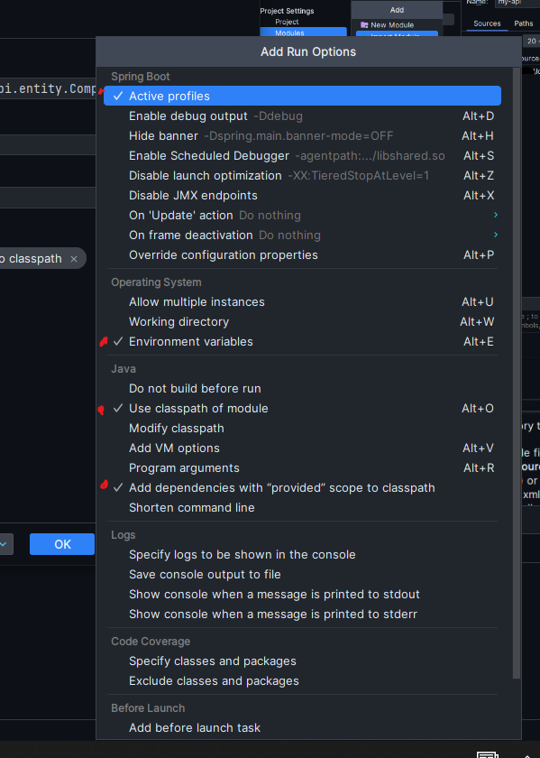

# 3rd Floor CSIS group project

## Table of contents
- [Overview](#overview)
- [Introduction](#introduction)
- [Setting-up](#setting-up)
  - [1. Clone the repository](#1-clone-the-repository)
  - [2. Configure dependencies](#2-configure-dependencies)
    - [2.1 Setup PATH](#21-setup-path)
    - [2.2 Select Local or System Path to set up](#22-select-local-or-system-path-to-set-up)
  - [3. Database Setup](#3-database-setup)
  - [4. Run Configurations](#4-run-configurations)
    - [4.1 Frontend](#41-frontend)
    - [4.2 Backend](#42-backend)
    - [4.3 Backend run configuration](#43-backend-run-configuration)
    - [4.4 Running to test](#44-running-to-test)
  - [5. Unit Tests](#5-unit-tests)
    - [5.1 Frontend](#51-frontend)
    - [5.2 Backend](#52-backend)
  - [6. Other Scripts](#6-other-scripts)
    - [6.1 Prettier](#61-prettier)

# Overview
This project is the goal to expand our knowledge on various features of a full-stack application. Including streaming, file management, security, UI/UX, responsiveness, various frameworks, monolithic and micro-frontend architectures, etc.

Begun this project with some of my course mates, to be a sandbox to be able to experiment and mainly just to learn 😃

# Introduction
The project's first goal is to implement a fullstack implementation of a streaming service. The project shall be divided into two main parts:
- Frontend
- Backend
    - With a database

Just to keep it simple, we will learn about file transfer, different protocols and how to implement them, and how to secure them. Going to try and abide by industry standards.

To keep it simple, we will implement a music/video streaming service. We will use (but not limited) to the following technologies:
- Angular for frontend
- Springboot for backend
- PostgreSQL for starting DB and potentially look into ORM DBs

**Future techs to learn about**
- Docker
- Kubernetes
- Microservices
- React
- Rust based backend
- HTMX

# Setting-up
## 1. Clone the repository
```bash
git clone https://github.com/M-Byte480/3rd_floor_csis/
```
Once the repo is cloned, you will notice how we have each directory nested within each other. Instead of opening existing project (assuming you use IntelliJ), in 2 separate IDEs, we will configure to be able to run the two instances within the same IDE.

[Jump back to top](#table-of-contents)
## 2. Configure dependencies

You will need to ensure you have the following installed:
- [Node.js](https://nodejs.org/en/download)
- [Java](https://www.oracle.com/ie/java/technologies/downloads/)
- [PostgreSQL](https://www.postgresql.org/download/)
  - [PgAdmin](https://www.pgadmin.org/download/) recommended, it should install with PostgreSQL

If you know how to set up PATH you can skip to [Step 3](#3-database-setup)

### 2.1 Setup PATH
Type `path` in your search bar and select _Edit Environment Variables_


### 2.2 Select Local or System Path to set up
In the screenshot below you can see we have two different types of paths. One is for the user account currently logged in, the other is for every user, aka System.


Your paths should lead you to two places:
- A: Directory for `.exe` files
- B: Directly to an `.exe` file

It should end up looking something like this:


To test it successfully working you can open up `cmd` and just type in the following 3 commands:
```bash
node -v
npm -v
ng v
```


[Jump back to top](#table-of-contents)
## 3. Database Setup
1. Once postgres is installed, find `C:\Program Files\PostgreSQL\16\bin` and add this path to your PATH. This will allow you to use `psql` in the command line.
2. Open CMD and type `pg_ctl init -D db` to create a new database cluster in the directory `db`
3. Start the database cluster by typing `pg_ctl -D db start`
   - Note: If you get an error, you may need to clear an instance of the database running on localhost and port 5432.
     - For **Windows**, making sure you are running CMD with **administrator**, this can be fixed by first checking whats running on the port:
     `netstat -aon | findstr :5432`

     - We can then kill the Process ID (PID), using ``taskkill /PID 12520 /F`` (replacing 12520 with your PID)
     - You can then rerun the ``pg_ctl -D db start`` command

_You may need to edit the `postgresql.conf` file to get it running, by defining which port and `localhost` address to run on. If uncommenting the two doesn't work, change the IP address to `127.0.0.1` from `localhost`_


Once running, make sure you do not close the terminal window. The instance is only running while the terminal is open. You can now connect to the DB via pgAdmin, psql in terminal, or any other DB management tool such as the one in IntelliJ.

[Jump back to top](#table-of-contents)

## 4. Run Configurations
### 4.1 Frontend
Once you have confirmed you can access `npm` and `ng` in the command line, you can now open up IntelliJ and configure the run configurations.  
Firstly, please navigate into the `frontends/angular` directory and run `npm install` to install all the dependencies.

Next, beside the run button there are configurations. 


Click on the `+` and select `npm` from the list. Then set up the configuration as follows:


Give it any name you want. After trying to run it, if done correctly this is what you should see:


### 4.2 Backend
`Ctrl + Shift + Alt + S` to open the Project settings window. Make sure you have an SDK setup. You can use the Java you downloaded, or you can download one with the current window open:  
</br>


Now navigate to Module settings, here we will need to let the IDE know that we have a subproject inside our project. Hit the `+` and select `Import Module`. Now follow through the screenshots:
</br>


</br>
</br>

</br>
</br>

</br>
</br>


Now you have set up the folder structure interpretation for the IDE. If you ever want to change your output directory, or the compiler is checking some folder which it shouldn't, this is where you can change it.

### 4.3 Backend run configuration
Once the module is set up, it should be auto-detected, if not then you can manually set it up as the following:
</br>

Hit the `+` and select `SpringBoot`. Now follow through the screenshots:
</br>

Set up the names as you wish and the project's root package. This is where the main class is located.
</br>
Hit `Modify options` and double check these are ticked:

</br>
</br>

Once you have the `Use environment variables` ticked, you can now add the following environment variables:
```
PORT=8080;dbName=yourNameForDB;dbPass=yourPasswordForDB;dbAddress=localhost;dbPort=5432
```
It should look something like this:


### 4.4 Running to test
If your console looks like this, with the last line being `Started Application in 2.5 seconds (process running for 3.456)`, then you have successfully set up the backend.
</br>


Now you are ready to start developing :)

[Jump back to top](#table-of-contents)

## 5. Unit Tests

### 5.1 Frontend
For the frontend, we will be using two types of testing frameworks:
- Karma (Jasmine)
- And Jest 
_We can reduce this to one, looking to see which one is better_

You can see in your package.json file that we have the following scripts:
```json5
  "scripts": {
    "ng": "ng",
    "start": "ng serve",
    "build": "ng build",
    "watch": "ng build --watch --configuration development",
    "test": "ng test",
    "jest": "jest",
    "jest-coverage": "jest --coverage",
    "lint": "ng lint",
    "prettier": "npx prettier . --write",
    "prettier-check": "npx prettier . --check"
  },
  ```
Each of these is a shorthand to execute each command. So if you were to type `npm run start` it would be the same as typing `ng serve`. Also, there will be green run buttons beside each so if you can't remember or don't have the run configurations setup, you can just click the green button.

If Jest still wouldn't run, you can right-click on `jest.config.ts` and it should create the run configuration for it. I am tending to lean towards learning Karma more, so watch-out for that.

### 5.2 Backend
For the backend, we will be using JUnit5 for our testing. You can see (if not added) the JUnit dependency in the `pom.xml` file.

[Jump back to top](#table-of-contents)

## 6. Other Scripts
### 6.1 Prettier
Prettier is a code formatter that will format your code to a standard. You can run this by typing `npm run prettier` in the command line. This will format all the files in the directory. If you want to check which files will be formatted, you can run `npm run prettier-check`.

[Jump back to top](#table-of-contents)
